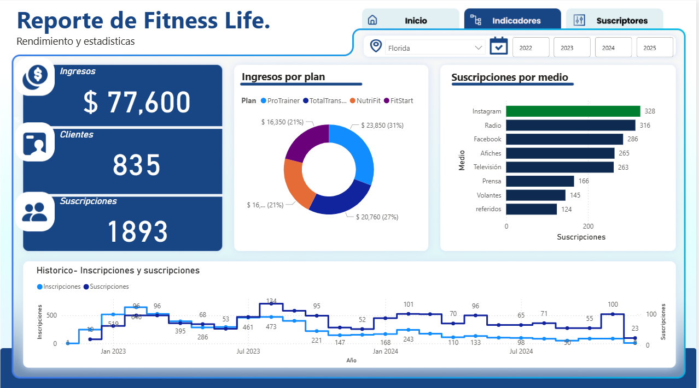
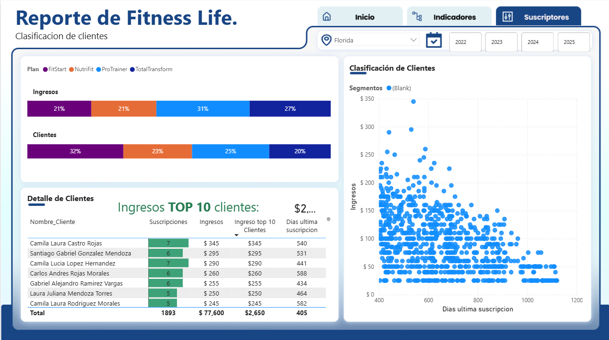

# powerbi-fitness-life-dashboard
Dashboard interactivo desarrollado en Power BI utilizando datos de una empresa ficticia del sector fitness (Fitness Life) para análisis y toma de decisiones empresariales.
# 📊 Dashboard Power BI – Fitness Life

## 🏋️‍♂️ Descripción del Proyecto
Este proyecto consiste en el desarrollo de un **dashboard interactivo en Power BI** utilizando datos reales de una empresa ficticia del sector fitness llamada **Fitness Life**.

El objetivo del dashboard es **transformar datos operativos en información clara y accionable**, facilitando la toma de decisiones empresariales mediante visualizaciones dinámicas y métricas clave.

El proyecto fue desarrollado como parte de una capacitación integral en Power BI, aplicando un flujo completo de análisis de datos: desde la limpieza y modelado hasta la visualización y publicación del reporte.

---

## 🎯 Objetivos del Dashboard
- Analizar el desempeño del negocio fitness
- Identificar métricas clave para la toma de decisiones
- Visualizar información de forma clara e interactiva
- Aplicar buenas prácticas de Business Intelligence

---

## 🧩 Proceso de Desarrollo

### 1️⃣ Transformación de Datos (Power Query)
- Importación de datos
- Limpieza y estandarización
- Manejo de valores nulos y formatos
- Preparación de tablas para el análisis

### 2️⃣ Modelado de Datos (Power Pivot)
- Creación de relaciones entre tablas
- Diseño de un modelo de datos optimizado
- Preparación del modelo para análisis avanzado

### 3️⃣ Cálculos y Medidas (DAX)
- Creación de métricas clave
- Medidas para análisis temporal y comparativo
- Indicadores de rendimiento (KPIs)

### 4️⃣ Visualización y Reportes (Power BI Desktop)
- Diseño de dashboards interactivos
- Gráficos dinámicos y segmentadores
- Enfoque en usabilidad y claridad visual

### 5️⃣ Publicación (Power BI Service)
- Publicación del reporte en la nube
- Compartición del dashboard para consulta online

---

## 📌 Métricas Analizadas
- Indicadores de rendimiento del negocio
- Análisis por períodos de tiempo
- Comparación de resultados
- KPIs relevantes para la gestión empresarial

*(Las métricas específicas dependen del modelo de datos proporcionado por Fitness Life)*

---

## 🛠️ Herramientas Utilizadas
- **Power BI Desktop**
- **Power Query**
- **Power Pivot**
- **DAX (Data Analysis Expressions)**
- **Power BI Service**
- **Excel (nivel básico)**

---

## 🔗 Dashboard Interactivo
👉 **[Enlace al dashboard en Power BI Service]**  

---

## 📸 Capturas del Dashboard
### 🏋️ Portada del Dashboard

*Vista general del dashboard de Fitness Life.*

### 📊 Indicadores Clave

*Principales KPIs del negocio fitness para el análisis de desempeño.*

### 👥 Análisis de Suscriptores

*Distribución y comportamiento de los suscriptores.*

---

## 📬 Contacto
- LinkedIn: *https://www.linkedin.com/in/angel-portilla-18921215b/*

